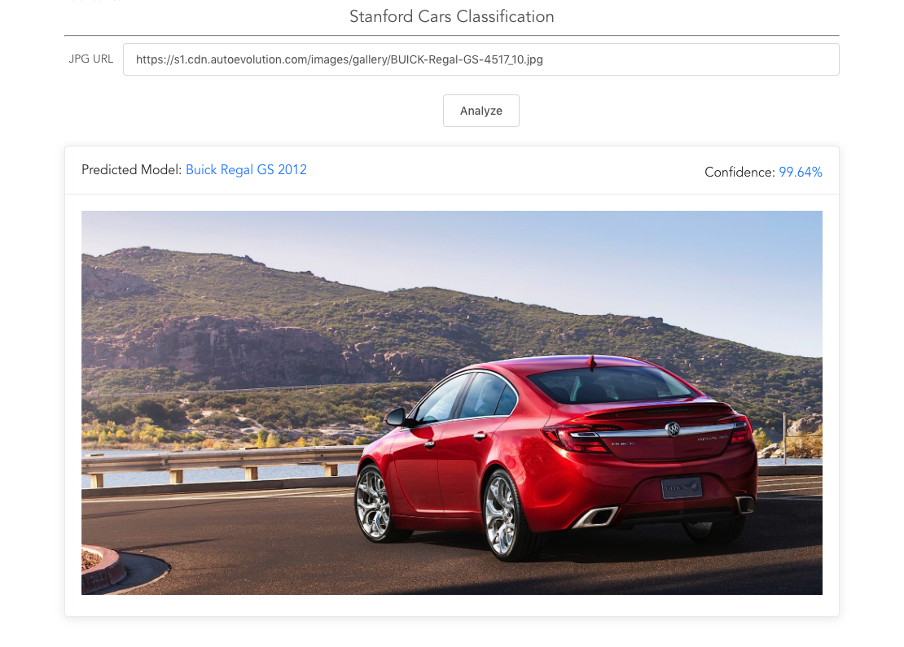

# Stanford Cars Classification
Do classification on Stanford Cars dataset.

## How to evaluate on private dataset
1. git clone this project and install required packages with the `requirements.txt`.
    ```bash
    git clone https://github.com/Joldnine/stanford-cars-classification.git
    cd stanford-cars-classification
    pip install -r requirements.txt
    ```
2. Remove my sample images under the folder `./dataset/test/`. Put images (must be jpg files) inside.

3. Paste the fact labels, ie. y_true, into file `test_labels.txt` with the order of sorted file names in step 2.

4. Go through the Jupyter notebook `model-evaluation.ipynb`. It will download other necessary files and run the model on your private test dataset. Eventually, metrics including accuracy and confusion metrics will be presented in the notebook.

## Application Deployment
The trained model has been deployed in my blog website: https://joldnine.github.io/#/cars-classification

The front-end is hold by Github, while the back-end is deployed in Azure Function App.

A screenshot:

